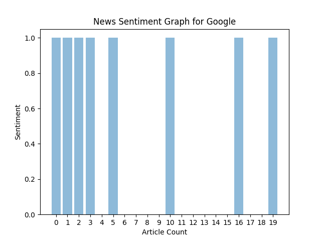
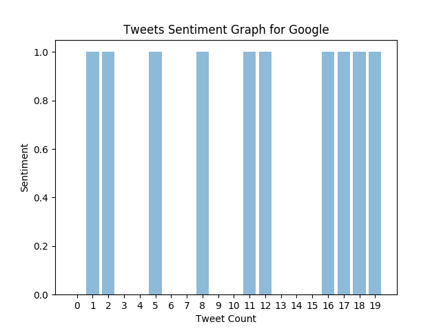
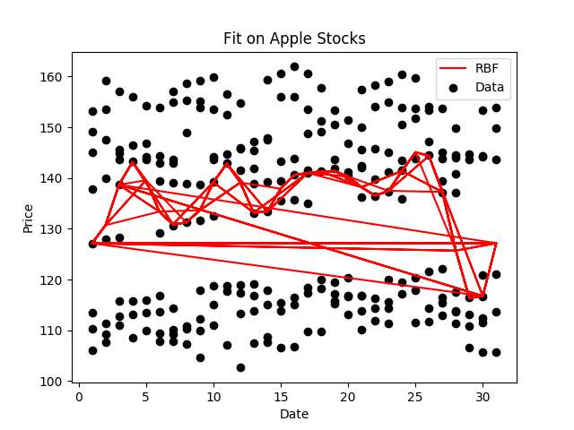
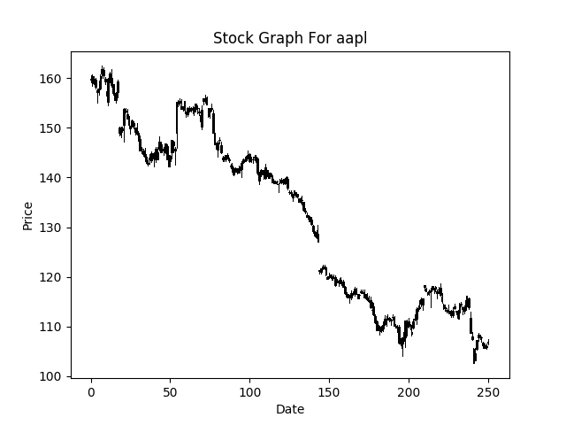
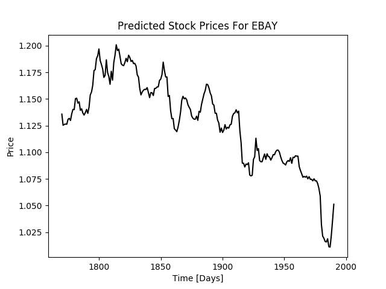
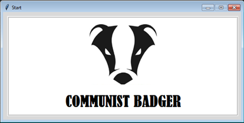
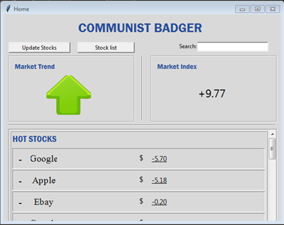
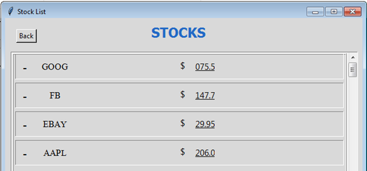
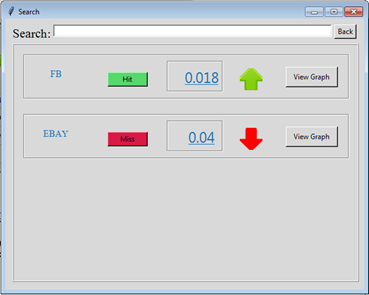
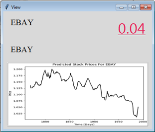

# CommunistBadger
CommunistBadger is a stock analysis tool build for multiple data and market analysis and recommendation.

## Visualizing News Sentiment
This is a sentiment graph for 20 news articles from CNBC against the word "Google".

## Visualizing Tweets Sentiment
This is a sentiment graph for 20 tweets scrapped from Twitter against the word "Google".

## Visualizing RBF Kernel For Stock Data
This is a fitted RBF Kernel graph for Apple Stocks Data.

## Candlestick Graphs for AAPL Stock Data
This is a candle stick graph on the Apple Stock Data using High, Close, Low and Open.

## Stock Prediction for EBAY
LSTMs trained on EBAY Stock for prediction of High, Close, Low and Open for next x days.

## GUI - using Python tkinter

